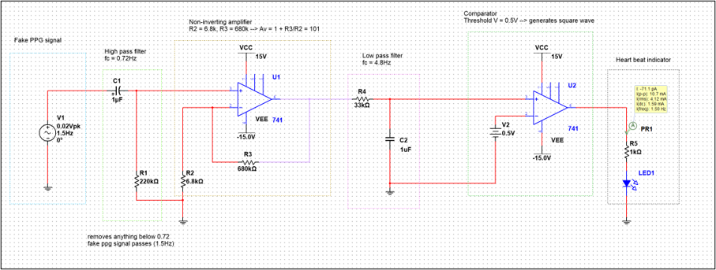
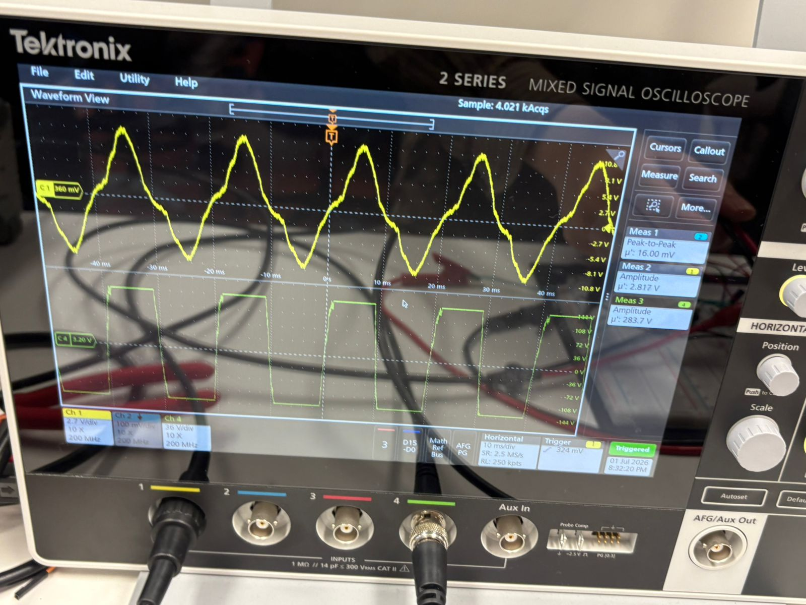
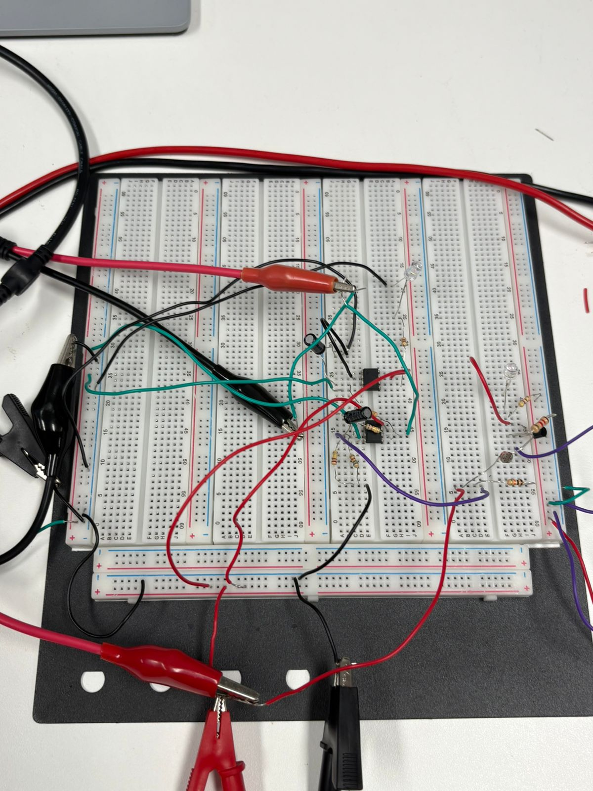
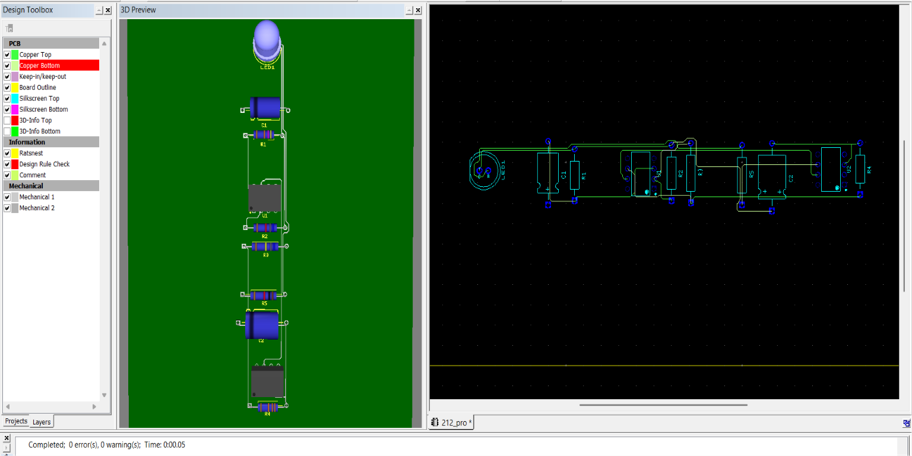

# PPG Heart Rate Detection Circuit

An analog Photoplethysmography (PPG) heart rate detection circuit designed using op-amps, active filters, comparator thresholding, and LED output indication.

## Overview

This project was completed as part of an university coursework electronics mini-project in a team of three. The aim was to design, simulate, build, test, and develop a PCB layout for a small analog signal-conditioning system using op-amp stages. The project received 3rd Place in the university mini-project showcase.

The circuit processes a heartbeat-style signal from a photoresistor-based input, filters unwanted frequency components, amplifies the signal, and uses a comparator to switch on an LED when a heartbeat pulse is detected, the output is also displayed on an oscilloscope.

## Features

- Photoresistor-based heartbeat sensing input (Multisim uses a small AC signal representing a heartbeat)
- High-pass filter for low-frequency noise removal
- Non-inverting op-amp amplifier with gain of approximately 101
- Low-pass filter for high-frequency noise reduction
- Comparator stage for heartbeat pulse detection
- LED output indicator
- Multisim circuit simulation
- Breadboard construction and testing
- PCB layout and 3D preview using Ultiboard

## Tools and Technologies

- Multisim
- Ultiboard
- 741 operational amplifier
- Active filters
- Non-inverting amplifier
- Comparator circuit
- PCB layout design

## Circuit Operation

1. A photoresistor-based input detects small light changes related to heartbeat-style variations.
2. The signal passes through a high-pass filter to remove very low-frequency components.
3. The filtered signal is amplified using a non-inverting op-amp amplifier.
4. The amplified signal passes through a low-pass filter to reduce high-frequency noise.
5. The conditioned signal is fed into a comparator.
6. When the signal exceeds the comparator threshold, the comparator output goes high.
7. The LED turns on to indicate a detected heartbeat pulse.

## Key Calculations

- Simulated heartbeat frequency: `1.5 Hz`
- Equivalent heart rate: `90 bpm`
- High-pass filter cutoff frequency: approximately `0.72 Hz`
- Amplifier gain: approximately `101`
- Low-pass filter cutoff frequency: approximately `4.8 Hz`
- LED current: approximately `13 mA`

## My Contribution

- Designed the analog signal-conditioning circuit stages.
- Calculated filter cutoff frequencies and amplifier gain.
- Built and tested the circuit simulation with team
- Constructed and tested the circuit on breadboard using a photoresistor-based input with team.
- Documented the design process of circuit construction and simulation. 

## Project Media

### Multisim Circuit Schematic

### Simulated PPG Waveform

### Breadboard Prototype

### PCB Layout and 3D Preview

